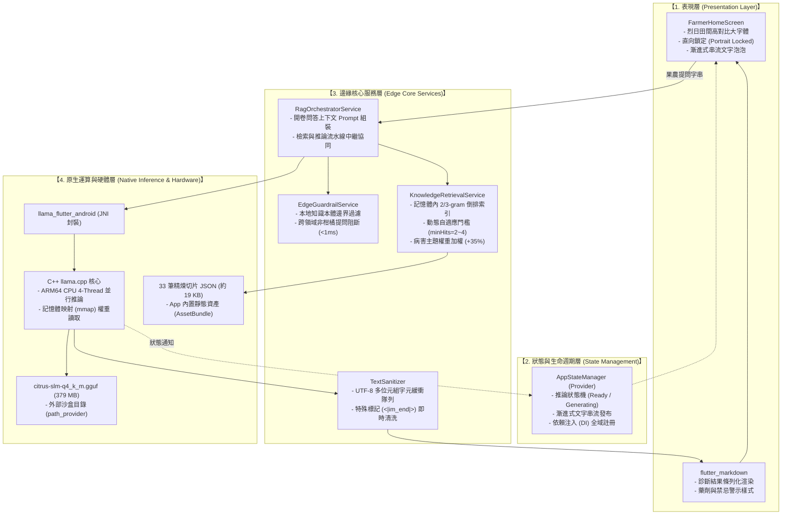
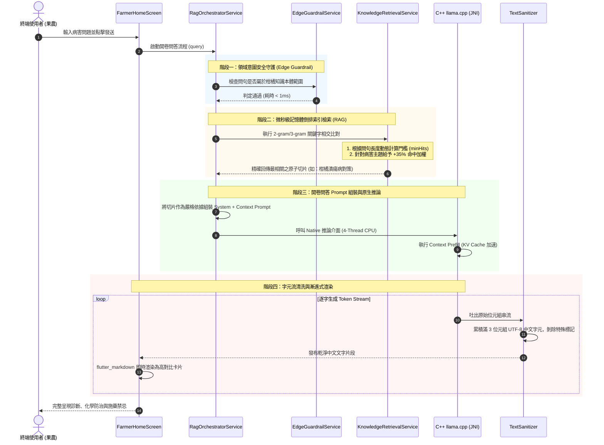

# 架構設計

## 系統總覽與落地部署
> 本文針對農業田間無網路或弱網環境之應用痛點，詳細介紹**柑橘病蟲害端側智能開卷問答系統 (On-Device RAG)** 於真實場域落地的生產級架構 (Production Deployment Architecture)。系統以純手機端 CPU 為運算載體，全面剝除雲端依賴，整合輕量化語言模型 (SLM)、倒排索引知識檢索、邊緣安全護欄與原生推論引擎，實現參數量 0.5B 級別小模型在終端設備上的即時、高忠實度診斷服務。
---
## 1. 落地技術棧架構矩陣 (Production Tech Stack Matrix)
在面向實際使用者的生產環境中，系統嚴格遵循**極致輕量化與零冗餘**原則，僅保留終端推論與互動必備的核心組件：
| 架構層級 | 框架 / 套件名稱 | 推薦版本 | 核心職責與學術定位 |
| :--- | :--- | :--- | :--- |
| **客戶端介面框架** | **Flutter SDK** | `>= 3.24.0` | 跨平台客戶端渲染框架，提供響應式 (Reactive) 使用者介面與單一執行緒事件循環 (Event Loop) |
| **端側推論引擎** | **`llama_flutter_android`** | `0.2.6` | 封裝底層 C++ `llama.cpp` 之 JNI 原生橋接庫，專責 ARM64 CPU 多執行緒模型推論 |
| **全域狀態管理** | **`provider`** | `^6.1.5` | 依賴注入 (Dependency Injection) 與狀態傳播，協調模型生命週期與 Token 串流狀態更新 |
| **沙盒儲存存取** | **`path_provider`** | `2.1.5` | 定位 Android 本地檔案沙盒目錄，負責外掛模型動態裝載與沙盒路徑解析 |
| **結構化排版渲染** | **`flutter_markdown`** | `^0.7.7` | 將 SLM 生成之 Markdown 文本即時渲染為農業專用大字體、條列化病徵與用藥警示卡片 |
| **核心語言模型** | **Qwen2.5-0.5B (SFT v5)** | GGUF | 經柑橘專用知識庫微調 (LoRA) 後量化為 `q4_k_m` 混合精度之輕量化模型 (379 MB) |
| **離線知識庫** | **33 筆原子知識切片** | JSON | 經農業專家審定之柑橘主要病害、蟲害與生理障礙結構化知識切片 (約 19 KB) |
---
## 2. 核心框架與依賴套件角色解析 (Core Frameworks & Libraries)
系統客戶端 (`citrus_rag_mobile`) 僅引入維持生產運行所必需之 5 個核心套件，將 APK 初始安裝包體積極限壓縮至 **55.5 MB**：
```yaml
dependencies:
  flutter:
    sdk: flutter
  cupertino_icons: ^1.0.8
  provider: ^6.1.5+1               # 全域狀態生命週期協同
  path_provider: 2.1.5            # 外部沙盒模型路徑定位
  llama_flutter_android: 0.2.6    # C++ llama.cpp JNI 原生推論橋接
  flutter_markdown: ^0.7.7+1      # 結構化病徵條列與藥劑標籤渲染
  intl: ^0.20.3                   # 時間與字串公用函式
```
### 2.1 `llama_flutter_android: 0.2.6`（原生推論核心）
- **學術與工程價值**：目前在行動裝置上實現**純離線、純 CPU、免專有 NPU/GPU 晶片依賴**的最佳開源實踐。
- **主要任務**：
1. **記憶體映射載入 (mmap)**：透過 JNI 直接將 379 MB 的 GGUF 權重檔案映射入記憶體，避免 Java/Kotlin 堆積 (Heap) 記憶體溢出 (OOM)。
2. **多核心並行排程**：指定 `threads = 4`，有效利用 ARM64 大核心算力，兼顧能耗比與生成速度。
3. **非同步 Token 串流**：以 Dart `Stream` 模式將解碼之 Token 逐一回傳，使首字反應時間 (Time-to-First-Token, TTFT) 壓低至 1\~2 秒內。
### 2.2 `provider: ^6.1.5+1`（狀態生命週期協調）
- **主要任務**：
1. **模型生命週期管理**：監控模型「未載入 $`\rightarrow`$ 載入中 $`\rightarrow`$ 待命就緒 $`\rightarrow`$ 推論中」之全域狀態機 (State Machine)，防止推論重入 (Re-entrance) 與資源競爭。
2. **串流文字反應更新**：透過 `ChangeNotifier` 高頻通知 UI 漸進式刷新文字，確保畫面流暢不卡頓。
### 2.3 `path_provider: 2.1.5`（沙盒儲存解耦）
- **主要任務**：
1. **軟體與權重解耦**：模型權重 (379 MB) 若直接打包進 APK 會違反 Google Play 150 MB 上限規定。`path_provider` 將模型位置固定於 Android 外部專屬沙盒：
```plain text
/sdcard/Android/data/com.citrus.citrus_rag_mobile/files/models/citrus-slm-q4_k_m.gguf
```
2. 允許未來模型版本無痛熱更新，無需重新編譯安裝 APK。
### 2.4 `flutter_markdown: ^0.7.7+1`（領域結構化視覺化）
- **主要任務**：
- SLM 推論輸出嚴格遵循農業領域結構（診斷摘要、核心病徵、建議藥劑、施藥禁忌）。
- 本套件將生成的 Markdown 標籤即時轉譯為適合田間烈日閱讀之大字體、高對比顏色標記與分項清單。
---
## 3. 向量知識庫與邊緣檢索架構 (Knowledge & Retrieval Architecture)
在 RAG 架構中，檢索庫與知識切片是抑制端側小模型 (0.5B) 產生災難性幻覺的根本基礎。本系統針對行動終端之極致資源限制，對知識存儲與向量檢索架構進行了專項工程設計：
### 3.1 知識切片庫階層規範與結構 (Chunking & Metadata Schema)
本系統未採用粗暴的固定長度滑窗切分 (Fixed-Length Chunking)，而是依據農業病理學決策邏輯，將 10 份農業試驗所權威文檔精煉為 **33 筆階層式原子切片 (****`citrus_hierarchical_kb.json`****)**：
- **四維決策劃分**：
1. `symptoms`（核心病徵特徵與發病部位）
2. `epidemiology`（發病季節、風雨傳播途徑與潛伏期）
3. `pesticides`（政府推薦化學防治藥劑與稀釋倍數）
4. `taboo`（關鍵用藥禁忌與物理防範警示）
- **切片資料結構 (JSON Schema)**：
```json
{
  "id": "canker_symptoms",
  "crop": "murcott",
  "disease": "citrus_canker",
  "category": "symptoms",
  "keywords": ["茂谷柑", "葉片", "火山口", "黃色暈圈", "黃單胞菌"],
  "content": "茂谷柑潰瘍病初期葉背出現油漬浸潤小點，隨後隆起破裂呈火山口狀，周圍具有鮮黃色暈圈..."

```
### 3.2 儲存引擎與檢索技術選型評估 (Storage & Retrieval Framework Evaluation)
在設計端側檢索層時，團隊針對多種行動端資料庫與向量檢索框架進行了深入評估：
| 評估維度 | 當前落地架構：純 Dart 記憶體倒排索引 (`dart:convert`) | 行動端關聯檢索：`sqflite` (SQLite + FTS5 全文索引) | 嵌入式端側向量庫：`sqlite-vss` / `sqlite_vec` | 傳統伺服器端向量庫：`Chroma` / `FAISS` |
| :--- | :--- | :--- | :--- | :--- |
| **套件依賴與體積** | **0 外部依賴** (純 Dart 內建庫) | 需引入 `sqflite` C 函式庫 (+8MB APK) | 需 cross-compile 向量 C++ 擴展 (+15MB APK) | 需 Python/C++ 運行環境 (無法直接塞入行動端) |
| **中文分詞能力** | **原生 2/3-gram** (無字串邊界限制) | Android SQLite 預設僅支援英文分詞，中文需額外編譯 `simple` / `jieba` 擴展 | 依賴外部 Embedding 模型輸出密集向量 | 依賴外部 Embedding 模型輸出密集向量 |
| **額外記憶體開銷** | **\< 1 MB** (全索引常駐 RAM) | \~15 MB (資料庫快取分頁) | 300MB+ (需常駐 Embedding 類神經網絡) | 500MB+ (向量維度乘載) |
| **端側檢索延遲** | **\< 1 ms** (微秒級純記憶體相交) | 5 \~ 15 ms (磁碟 I/O 查詢) | 1,500 \~ 3,000 ms (CPU 運算密集向量) | 50 \~ 200 ms (網路 RPC 往返) |
| **離線部署穩定性** | **極高** (零破壞風險、零資料庫損毀) | 中等 (需防範 SQLite 資料庫鎖死與遷移升級) | 低 (Android ARM64 ABI 兼容性挑戰) | 依賴連網 (無網路環境無法運行) |
> **選型決策**：針對當前 33 筆精煉切片，**純 Dart 記憶體稀疏向量/倒排索引為效能與穩定性之帕雷托最優解 (Pareto Optimal)**；若未來切片擴增至 1,000+ 筆以上，系統亦可平滑對接 `sqflite` + FTS5 進行外存階層分頁。
### 3.3 記憶體倒排索引演算法機制 (In-Memory Inverted Index Algorithm)
在 `KnowledgeRetrievalService` 中，檢索流程採用雙重加權與動態門檻機制：
1. **2-gram / 3-gram 特徵抽取**：克服中文缺乏空格斷詞之特性，自動將使用者輸入切分為雙字與三字特徵段（如「火山口」$`\rightarrow`$ `["火山", "山口", "火山口"]`）。
2. **長度自適應門檻 (Dynamic ****`minHits`****)**：
- 短問句（\< 15 字）：最低命中詞門檻自動降為 `minHits = 2`，避免有效短問題漏召回。
- 長問句（$`\ge 25`$ 字）：門檻動態提高至 `minHits = 4`，抑制雜訊詞引發之虛假匹配。
3. **病害主題本體加權 (Disease Title Boost)**：若問句命中已知柑橘病害名稱（如「潰瘍病」、「油斑病」），賦予 **+35% 命中權重**，確保標靶切片高居第一順位。
4. **容錯正則正規化 (****`normalizeQuery`****)**：自動將常見農民錯別字（如「黑點並」$`\rightarrow`$「黑點病」）進行音近/形近正規化，大幅提升田間提問寬容度。
---
## 4. 四層式端側落地系統架構 (4-Tier On-Device Architecture)
本系統落地架構嚴格劃分為四層，從最上層使用者操作到最底層硬體運算，層層解耦且職責明確：

---
## 5. 組件組裝與完整資料流向 (End-to-End Inference Pipeline)
當終端使用者在田間提出一個具體問題（例如：「*柑橘葉片正面出現淡黃色小斑點，背面有黃褐色凸起病斑，該噴什麼藥？*」）時，系統內部的端到端協同生命週期如下：

---
## 6. 邊緣端關鍵工程優化技術 (Edge Engineering & Robustness)
為了在有限的行動終端硬體環境中達到工業級的穩定性，本落地架構實施了三項關鍵工程設計：
### 6.1 邊緣極速語意護欄 (`EdgeGuardrailService`)
- **痛點**：端側手機算力寶貴，若使用者輸入非柑橘領域閒聊（如天氣、股市、其他作物），啟動 SLM 會徒增裝置發熱與耗電。
- **工程解法**：設計基於農作物本體詞典 (Domain Ontology) 的前置過濾器。在調用推論引擎前進行毫秒級匹配，非柑橘提問直接由本地規則阻斷並引導聚焦，保護手機續航。
### 6.2 UTF-8 串流多位元組緩衝隊列 (`TextSanitizer`)
- **痛點**：中文常用字在 UTF-8 編碼中佔用 3 個位元組。C++ 底層 `llama.cpp` 逐 Token 輸出時，經常在字元邊界發生位元組截斷，導致傳回 Dart 層時解析出破字、問號亂碼（例如 `[礦]物油` 碎裂為亂碼或丟失）。
- **工程解法**：在 JNI 回調邊界實作自適應位元組緩衝隊列，若偵測到不完整之 UTF-8 開頭字元，暫存緩衝區直至下一個 Token 抵達補齊 3 位元組後才發射，達到中文輸出 **100% 零亂碼**。
### 6.3 裝置外掛與記憶體映射 (mmap)
- **痛點**：若將數百 MB 的大型二進位模型直接放入 App `assets`，Android 在編譯與解壓縮時會消耗龐大系統記憶體，且極易引發 `OutOfMemoryError`。
- **工程解法**：將模型抽離為外部沙盒檔案，利用 POSIX `mmap` 機制按需載入虛擬記憶體頁，使實機運行時的 RAM 佔用穩定壓制在 **400 MB \~ 500 MB** 水平，即使在 4GB RAM 的平價入門手機上也能常駐運作。
---